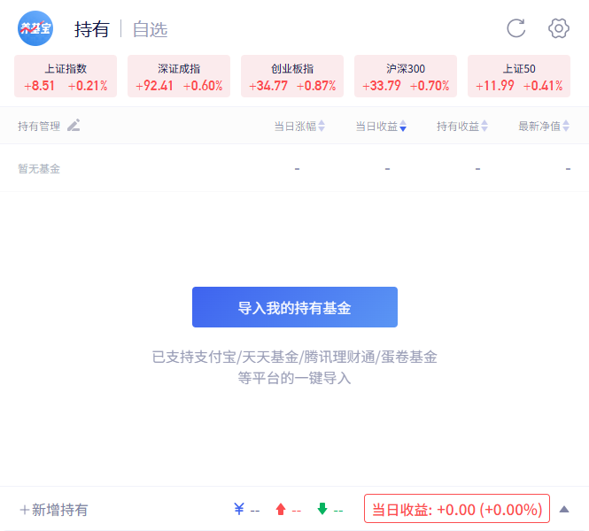
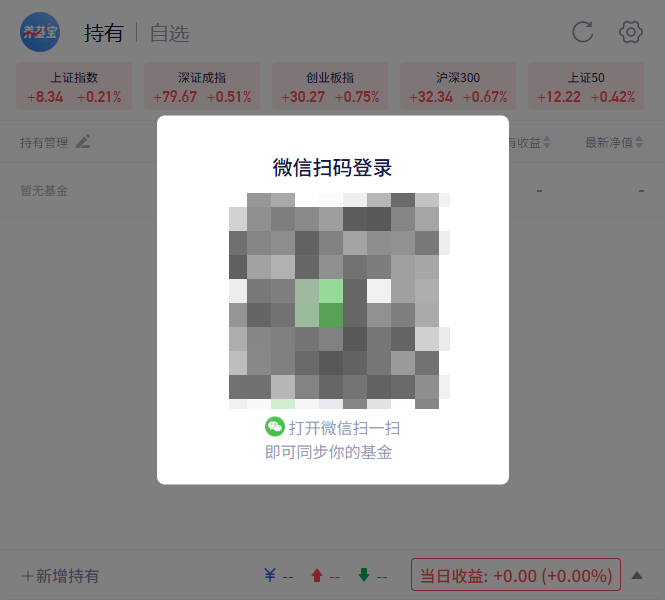
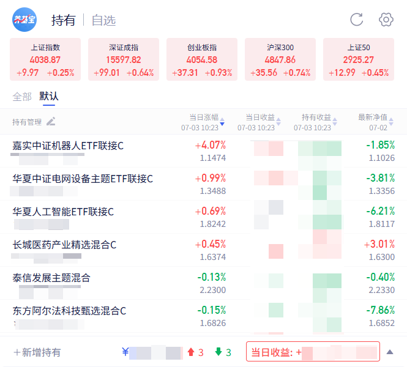

# 养鸡宝 Chrome 插件
（养基宝官网下载的插件AI魔改，解决官方的插件不实时刷新收益率/收益的问题，侵删）

使用新浪基金估值、东方财富基金净值/持仓和证券行情接口，并在公开估值缺失时按持仓权重自行推导。

这是一个 Chrome MV3 插件，用于通过养鸡宝的微信扫码入口登录账号，并在浏览器弹窗中查看基金持仓、指数行情、实时估值、当日收益和角标收益提醒。

注意：本插件只有养鸡宝的微信扫码登录入口，没有支付宝、天天基金、腾讯理财通、蛋卷基金等平台的扫码登录入口。代码中出现这些平台名称，是用于展示账户来源或导入说明，不代表存在对应平台的扫码登录接口。

## 功能概览

- 微信扫码登录养鸡宝账号。
- 同步账号列表、基金持仓、账户汇总和收益曲线。
- 展示上证指数、深证成指、创业板指、沪深 300、上证 50 等指数行情。
- 根据持仓和公开估值接口计算当日收益。
- 支持浏览器角标显示当日收益或收益率。
- 支持基金搜索、添加持仓、删除持仓。
- 展示已同步到本地的 App 自选基金分组、估算净值、当日涨幅和关联板块。
- 点击基金弹出详情浮层，查看净值估算走势与历史净值走势。

## 截图

### 持仓首页与导入入口



### 微信扫码登录



### 基金持仓与收益展示



## 登录与数据流程

1. 弹窗点击登录后，请求养鸡宝后端生成微信登录二维码。
2. 用户使用微信扫码。
3. 插件轮询二维码状态接口。
4. 登录成功后，后端返回 `token`、头像和昵称。
5. 插件使用该 `token` 请求账号列表、基金持仓、收益数据等接口。
6. 持仓数据会结合公开基金估值或公开持仓行情补充实时估值，再计算界面和角标收益。

浏览器扫码返回的 `token` 只用于持仓接口，不能请求 App 自选接口，也不会影响手机 App 登录。App 自选接口则与手机 App 共用服务端的单会话限制：在插件中通过短信登录会使手机 App 退出，手机 App 再次登录也会使该 App Token 失效。

为避免插件和手机 App 反复互踢，插件只在首次初始化或用户主动点击“同步列表”时登录 App 接口。同步时会一次性保存全部分组及各分组基金，成功后立即从插件存储中删除 `appToken`。之后正常打开自选、切换分组或点击顶部刷新都只读取本地自选列表，并通过公开行情接口更新估算净值和当日涨幅，不再访问 App 自选接口。手机 App 中新增、删除或调整分组后，需要再次手动同步；同步会再次使手机 App 退出，完成后可回到手机 App 重新登录。手机号和验证码不会写入插件存储。

App 自选相关接口：

```text
POST https://app-api.yangjibao.com/send_code
POST https://app-api.yangjibao.com/login
GET  https://app-api.yangjibao.com/users/v1/fund-group
GET  https://app-api.yangjibao.com/position/v1/option/all
GET  https://app-api.yangjibao.com/position/v1/option/group?group_id={id}
```


### 公开基金估值接口

| 来源 | 方法 | 地址 | 用途 |
| --- | --- | --- | --- |
| 新浪基金估值 | GET | `https://hq.sinajs.cn/list=fu_{code1},fu_{code2}` | 批量获取普通基金当日估值 |
| 东方财富基金净值 | GET | `https://fundmobapi.eastmoney.com/FundMNewApi/FundMNFInfo?...&Fcodes={codes}` | 获取估值计算所需的最新已披露净值 |
| 东方财富基金持仓 | GET | `https://fundmobapi.eastmoney.com/FundMNewApi/FundMNInverstPosition?FCODE={code}` | 获取联接 ETF 和已披露股票占比 |
| 东方财富证券行情 | GET | `https://push2delay.eastmoney.com/api/qt/ulist.np/get?secids={secids}` | 批量获取 ETF、指数和持仓股票涨跌幅 |
| 天天基金分钟估值 | GET | `https://fundcomapi.tiantianfunds.com/mm/newCore/FundVarietieValuationDetail?FCODE={code}` | 详情浮层的分钟级估值走势（接口有数据时） |
| 东方财富历史净值 | GET | `https://fundmobapi.eastmoney.com/FundMApi/FundNetDiagram.ashx?FCODE={code}&RANGE={range}` | 详情浮层的历史净值走势 |

后台估值按以下顺序降级：新浪批量估值 → 联接 ETF 行情 → 跟踪指数行情 → 已披露股票持仓加权。持仓推导公式为 `Σ(股票净值占比 × 股票涨跌幅) / 100`，未披露资产按当日不变处理，避免把前十大持仓错误放大到 100%。货币基金、纯债基金等没有可靠盘中行情的品种不会伪造估值，继续展示最新已披露净值。

东方财富移动基金接口会拒绝浏览器默认 User-Agent。`rules/sina-estimate.json` 中的 DNR 规则只针对该域名改写为移动客户端 User-Agent，同时为新浪估值接口补充必需的 Referer。

## 基金详情浮层

在持仓列表或搜索列表点击任意基金，弹出详情浮层，包含两个标签页：

- **历史净值（默认）**：展示单位净值走势，Y 轴以发行值为基准换算为涨跌幅百分比（净值 1.1 显示 +10%，0.9 显示 -10%），支持 1 月 / 3 月 / 1 年 / 3 年 / 创建以来时间范围，默认打开 1 年。
- **净值估算**：按优先级降级取数——分钟估值明细 → 联接 ETF / 跟踪指数 / 持仓行情推导曲线 → 实时估值快照采样。若所有分钟级接口均无数据，则用实时采集的当日涨跌幅按相同的百分比走势图渲染，并每 8 秒轮询累计采样点。

### 插件权限对应的域名

`manifest.json` 中声明了这些访问域名：

```text
http://192.168.101.181:8010/yjb_plugin/*
http://yjbplugin-test.52guihua.cn/*
http://browser-plug-api.yangjibao.com/*
https://app-api.yangjibao.com/*
https://fundmobapi.eastmoney.com/*
https://api.fund.eastmoney.com/*
https://fundcomapi.tiantianfunds.com/*
https://push2his.eastmoney.com/*
https://push2delay.eastmoney.com/*
https://searchapi.eastmoney.com/*
https://hq.sinajs.cn/*
```

其中 `browser-plug-api.yangjibao.com` 是浏览器持仓后端，`app-api.yangjibao.com` 用于 App 自选登录、分组和列表；其余域名用于基金估值、历史净值、行情走势与搜索等数据补充，供详情浮层与收益计算使用。

## 关于第三方平台名称

界面文案中出现“支付宝 / 天天基金 / 腾讯理财通 / 蛋卷基金”，含义是插件可展示或导入这些来源的基金持仓数据。它们不是扫码登录入口，代码里也没有对应这些平台的扫码登录接口。

当前扫码相关接口只有：

```text
GET /qr_code
GET /qr_code_state/{qrId}
```

这两个接口用于养鸡宝账号的微信扫码登录。

## 安装方式

1. 打开 Chrome，进入 `chrome://extensions`。
2. 打开右上角“开发者模式”。
3. 点击“加载已解压的扩展程序”。
4. 选择本项目目录。
5. 点击浏览器工具栏中的插件图标使用。

## 项目结构

```text
.
├── assets/             # 插件图标与静态资源
├── css/                # 样式文件
├── Image/              # README 截图
├── js/                 # 前端弹窗与后台打包脚本
├── manifest.json       # Chrome 扩展配置
├── popup.html          # 插件弹窗入口
└── service-worker.js   # MV3 后台 Service Worker
```

## 调试说明

修改代码后，需要在 `chrome://extensions` 中重新加载插件。由于这是 Chrome MV3 插件，后台逻辑运行在 Service Worker 中，浏览器可能会缓存旧的后台脚本，重新加载后才能确保新代码生效。

常用检查命令：

```bash
node --check js/popup.js
node --check js/background.js
node --check service-worker.js
node ../tests/app-api.test.js
node ../tests/valuation-service.test.js
```
